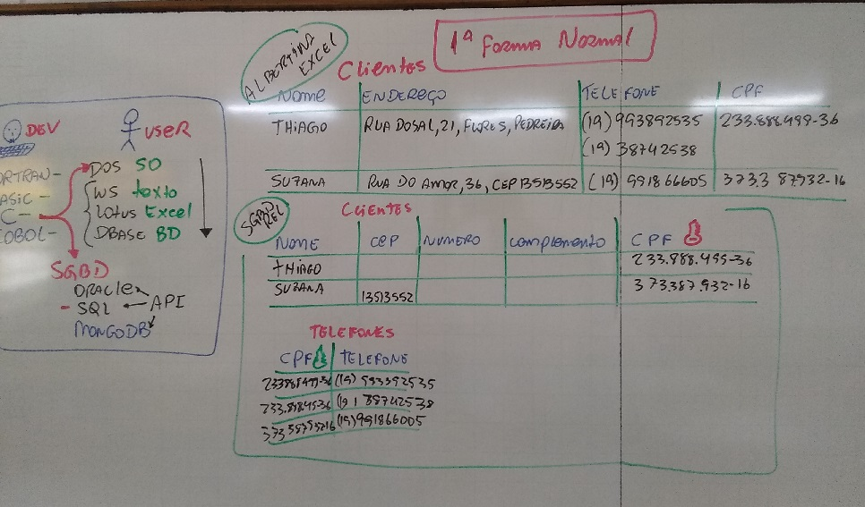
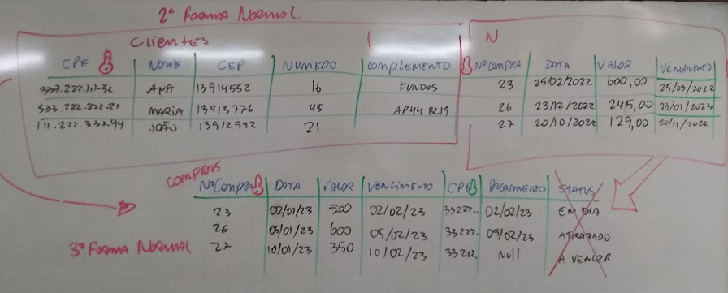
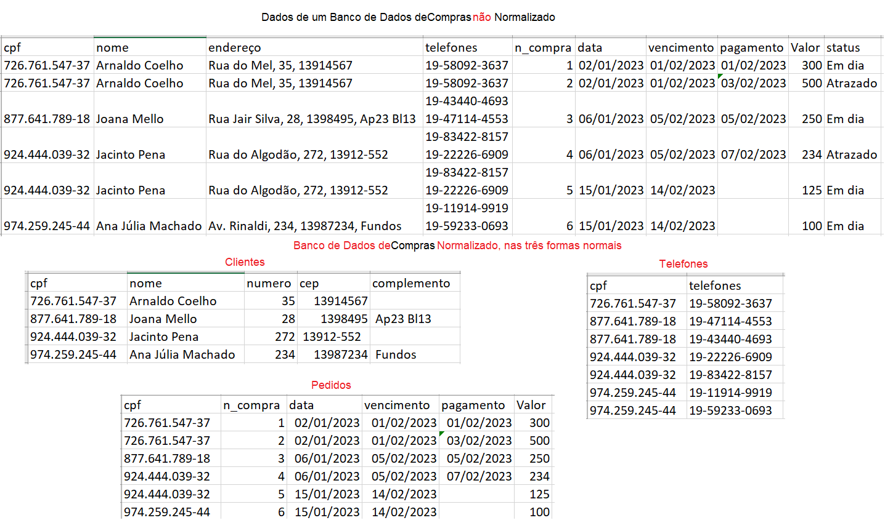

# Normalização (BD - Estruturado, SQL e Relacionais)
- Preparar dados brutos para serem depositados em um BD
- Benefícios
	- Reduz redundância
	- Reduz inconcistência
	- Melhora o desempenho
- 
- 
- 
# Exemplo:
- 
- 
# Exercício Aula.
- 1. Criar o script SQL (DDL)
- 2. Criar o script SQL (DML)
	- Inserir pelo menos, 3 clientes
	- Um ou dois telefones por cliente
	- Seis pedidos
# Exercícios:
- Baseado no exemplo "./exercicios/exemplo_compras.xlsx":
	- 1. Normalize a planilha ./exercicios/exercicio1_clientes.xlsx
	- 2. Normalize a planilha ./exercicios/exercicio1_escola.xlsx
	- 3. Normalize a planilha ./exercicios/exercicio1_onibus.xlsx
	- 4. Normalize a planilha ./exercicios/exercicio1_parcelas.xlsx
	- 5. Normalize a planilha ./exercicios/exercicio1_pedidos.xlsx
