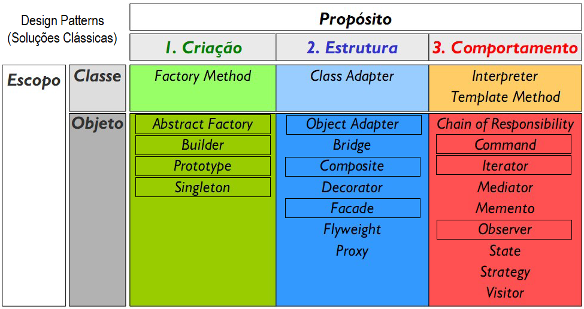
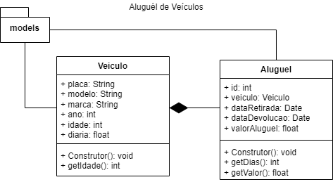

# 2. Padrão de desenvolvimento MVC
- 2.1. Definição
- 2.2. Aplicabilidade
- 2.3. Design patterns
# Design Patterns - GOF
- Criação
- Estrutura
- Comportamento
 

## Links importantes
- (patterns x standard) https://www.youtube.com/watch?v=GUanHEGlje4&t=1440s
- Slides: https://github.com/wellifabio/senai2021/blob/master/3des/projetos/aula22/design_patterns.pdf
- Exemplos com Java: https://github.com/wellifabio/senai2022/tree/master/3des/projetos/aula09/exemplo-java
- POO Classes em JavaScript https://developer.mozilla.org/pt-BR/docs/Web/JavaScript/Reference/Classes

## Atividades
|Atividade|Diagrama de Classes|
|-|-|
|1) Modele com JavaScript as classes conforme o diagrama de Classes utilize o Pattern Builder||
