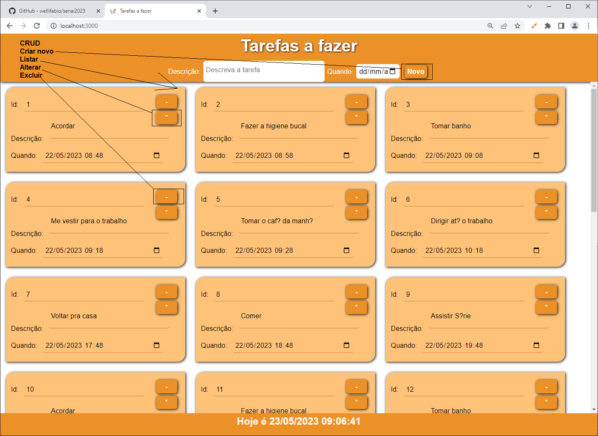
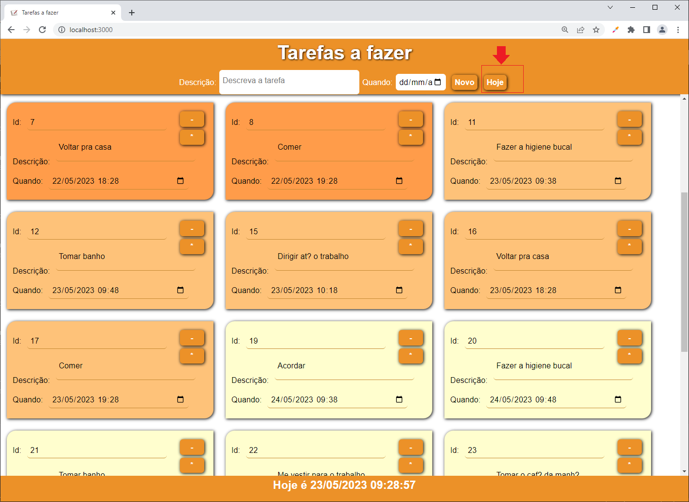

# Situação Problema

|Contextualização|
|-|
|Como programador da **XPTO indúsctria que produz de tudo** você precisa dar manutenção nos softwares que estão em andamento|

|Desafio|
|-|
|Sua missão no sprint desta semana é acrescentar algumas funcionalidades na agenda **(afazer)** de tarefas dos executivos da empresa, O código do projeto está neste repositório na pasta **./afazer**|
| Tela principal do programa **./afazer**|
|Sua missão é implementar as seguintes funcionalidades:|
|- Separar por cor as tarefas do passado, presente e futuro em outras palavras as de antes de hoje, as de hoje e as de depois de hoje.|
|- Adicionar um botão que ao ser clicado filtre as tarefas mostrando somente as de hoje e se clicado novamente volte a mostrar todas as tarefas, conforme o wireframe a seguir.|
| Wireframe com as funcionalidades adicionadas|

|Entregas|
|-|
|Apresente ao instrutor o software em execução com as funcionalidades adicionadas|