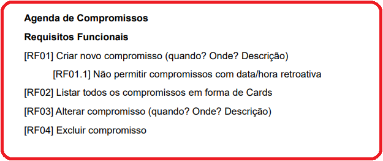
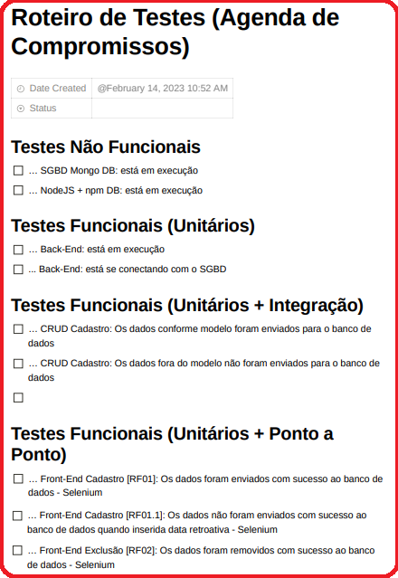
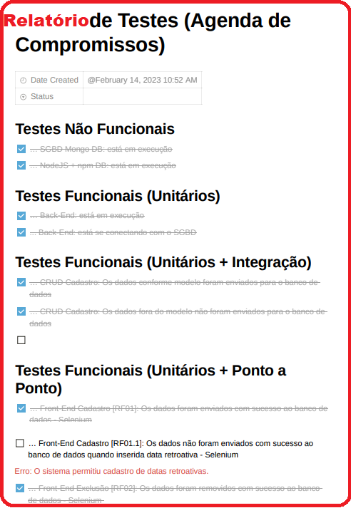

# Aula03 -  Roteiro e relatório
- Roteiro de Testes (Plano de Testes)
- Relatório de Testes (Execução de Testes)

## 2. Planejamento de testes
- 2.1.Análise de risco
	- Inicialmente Verificar os requisitos Funcionais e Não funcionais.
	- Destacar possíveis vulnerabilidades de segurança, como:
		- Exposição de dados sensíveis
		- Exposição de senhas
		- Fluxo de atividades (Login, tipo de perfil de acesso)
		- Ambiente de implantação (Rede, Nuvem)
		- Framework de implantação
	- **Legislações (No caso do Brasil temos a LGPD)**
### Exemplo de Plano/Roteiro de testes de (Sistema, Validação, Integração e Unidade):
### Requisitos Funcionais
 

## Roteiro - [Exemplo de roteiro segundo ChatGPT](./roteiro_segundo_chatgpt.md)
- 2.2.Plano de teste
	- Após a avaliação, elaborar o plano/roteiro de testes.
- Ex (**CheckList**):
 	

## Relatório
- 3. Execução de testes
	- 3.1.Ambiente de teste
		- 3.1.1.Configuração
	
 
- Concluído o relatório a equipe de desenvolvimento realiza as correções destacadas
- E o processo se inicia novamente.

## Sugestão de Atividade
- Caso prático de testes:
	- A partir do seu projeto FullStack "Restaurante"
	- Criar uma lista de requisitos funcionais (Somente a descrição, não precisa de DCUs)
	- Escolha um colega de turma e elebore um <b>Roteiro de Testes</b>
	- Separar por testes Não Funcionais e Funcionais
	- Separar os testes funcionais em (Unitário, Unitário + Integração, Unitário + Ponto a Ponto)
	- Execute os testes no projeto de seu colega.
	- Ao final elabore um Relatório com o checklist preenchido e os probemas encontrados.